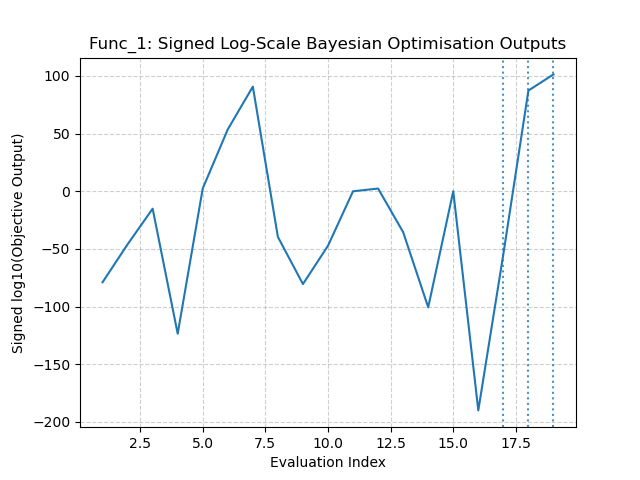
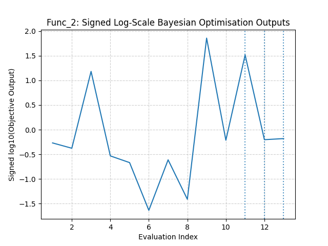
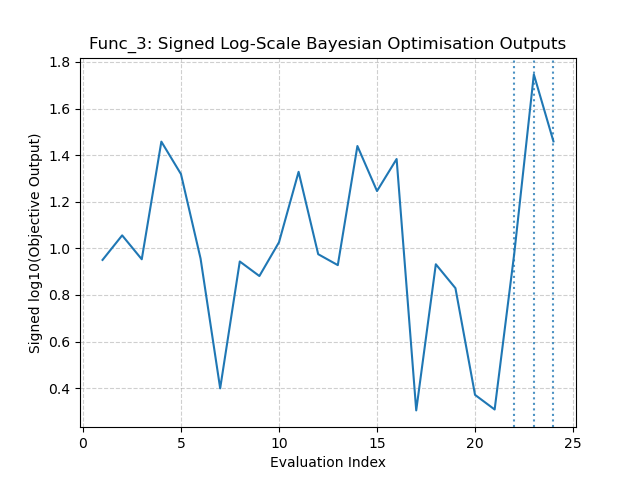
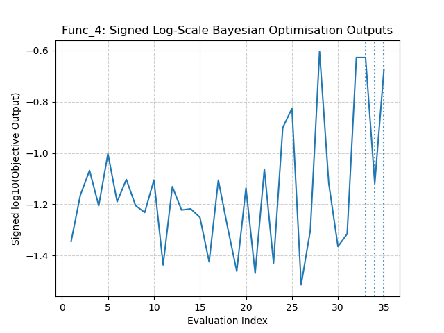
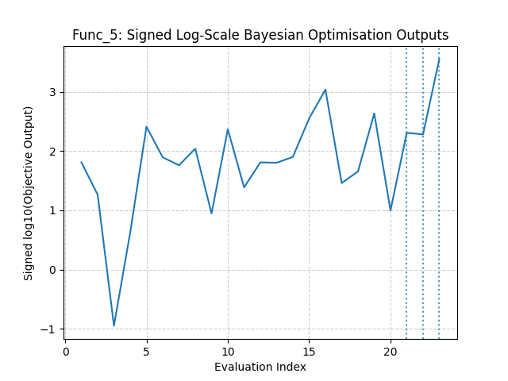
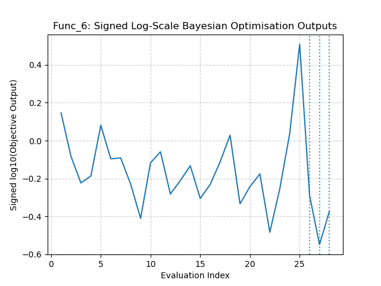
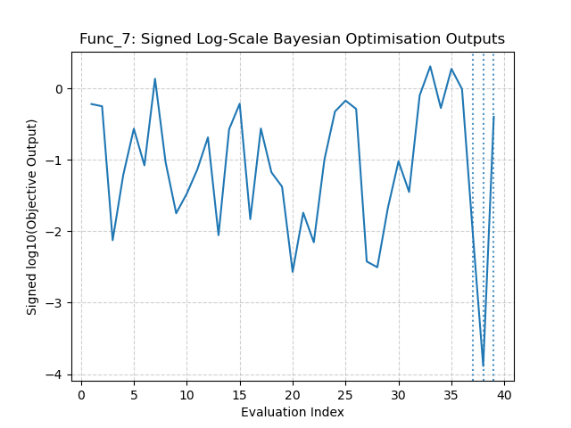
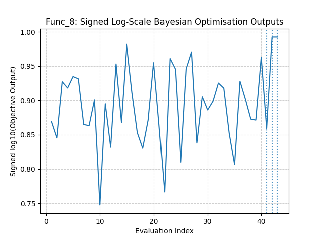

# Week 5

Adjustments Log
- 
  - Currently using a gradient-based minimizer with 10 multi-starts. Switching to randomly sampling sampling a larger space and submitting the best candidate after evaluating all `n` candidate. This change ensures that the GP generates `n` number of possible candidates(`X_next`) in the given search space $[0, 1]^d$. The acquisition point is evaluated at the generated candidate points, with the highest acquisition value being chosen as the final value
  This is computationally intensive but, it should help to reach our maximisation goal faster. 

## Function 1

## Function 2

## Function 3

## Function 4

## Function 5

## Function 6

## Function 7

## Function 8

# Week 6
Adjustment Log
- introduced function-specific acquisition hyperparameter tuning. 
- dedicating this cycle to addressing the lack of use of acquisition hyperparameter usage to obtain proposed input values. I'm addressing this change as prescribed in a previous sentence. This is problematic; it means we have been using values with limited exploration search space. Hopefully this cycle should address that and give us a much better understanding of which regions are profitable and which regions are not worth exploring. After that, we can dive deeper into exploitation. 
- Improve GP noise/normalisation robustness
  - Issue: GP uses fixed tiny noise `alpha=1e-6` with no target normalisation. 
  - Impact: Outputs have shown to span extreme scales. Surrogate model can become overconfident/ill-conditioned, distorting EI/UCB and exploration-exploitation balance.
  - Proposed fix: Enable output normalisation, tune/increase `alpha` (or use a noise kernel) with bounded hyperparameters.
  - Validation: verify best found traces before/after for all functions
- 